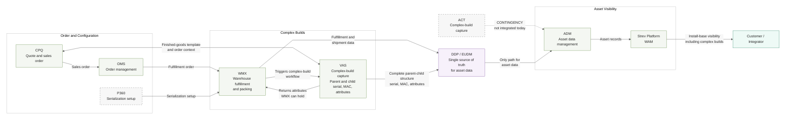

```mermaid
%%{init: {"theme":"base","themeVariables":{"primaryColor":"#f7f7f7","primaryBorderColor":"#9aa0a6","primaryTextColor":"#222222","lineColor":"#555555","clusterBkg":"#ffffff","clusterBorder":"#b8b8b8","tertiaryColor":"#ffffff"},"flowchart":{"diagramPadding":30,"nodeSpacing":55,"rankSpacing":85,"wrappingWidth":150,"curve":"linear"}}}%%
flowchart LR
    subgraph orderLayer["Order and Configuration"]
        direction TB
        cpq["CPQ<br/>Quote and sales order"]:::app
        oms["OMS<br/>Order management"]:::app
        p360["P360<br/>Serialization setup"]:::external
    end

    subgraph complexBuilds["Complex Builds"]
        direction TB
        wmx["WMX<br/>Warehouse fulfillment<br/>and packing"]:::app
        vas["VAS<br/>Complex-build capture<br/>Parent and child serial, MAC, attributes"]:::app
    end

    ddp["DDP / EUDM<br/>Single source of truth<br/>for asset data"]:::data
    act["ACT<br/>Complex-build capture"]:::external

    subgraph wamLayer["Asset Visibility"]
        direction TB
        adm["ADM<br/>Asset data management"]:::app
        strev["Strev Platform<br/>WAM"]:::app
    end

    customer["Customer / Integrator"]:::user

    cpq -->|"Sales order"| oms
    oms -->|"Fulfillment order"| wmx
    p360 -->|"Serialization setup"| wmx
    cpq <-->|"Finished-goods template<br/>and order context"| vas
    wmx -->|"Triggers complex-build<br/>workflow"| vas
    vas -->|"Returns attributes<br/>WMX can hold"| wmx
    wmx -->|"Fulfillment and<br/>shipment data"| ddp
    vas -->|"Complete parent-child structure<br/>serial, MAC, attributes"| ddp
    act -.->|"CONTINGENCY<br/>not integrated today"| adm
    ddp -->|"Only path for<br/>asset data"| adm
    adm -->|"Asset records"| strev
    strev -->|"Install-base visibility<br/>including complex builds"| customer

    classDef app fill:#f4f7f2,stroke:#6a8f4e,stroke-width:1px;
    classDef data fill:#f7f1fb,stroke:#8a63a8,stroke-width:1px;
    classDef external fill:#f7f7f7,stroke:#777,stroke-dasharray: 5 5;
    classDef user fill:#eefaf6,stroke:#3b8f73,stroke-width:1px;
```
